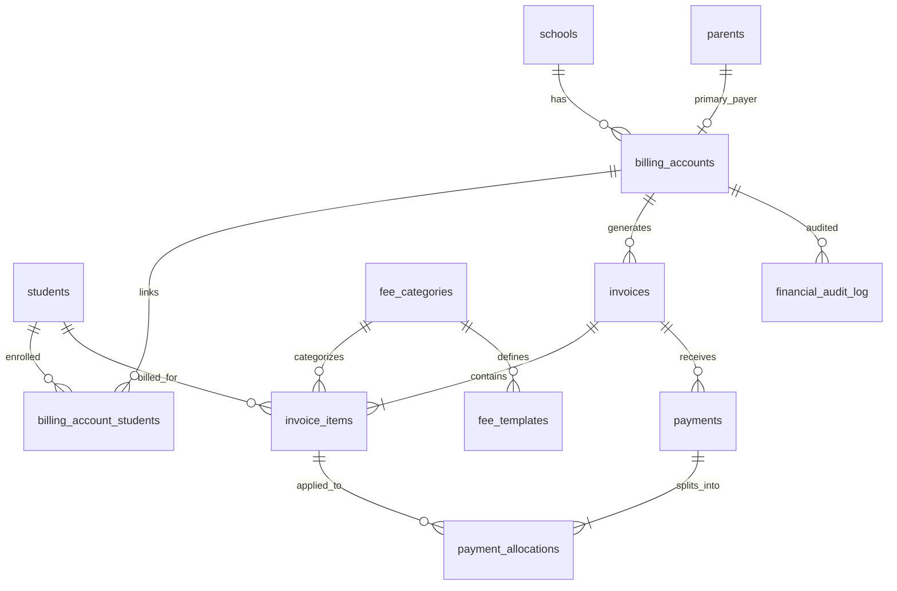

# Multi-Child Consolidated Billing Engine — Backend Handoff

**Audience:** Database / backend engineer implementing billing for School Hub  
**Stack:** Supabase (PostgreSQL 15+), Row Level Security, Deno Edge Functions, Stripe  
**Status:** Implemented in migration `20260528000000_multi_child_consolidated_billing.sql` + admin UI `/admin/billing/family`

---

## 1. Alignment with Current School Hub

### What exists today

| Area | Current behavior | Location |
|------|------------------|----------|
| Parent ↔ students | `students.guardian_id` → `parents.id` (one guardian FK per student) | `students`, `parents` |
| Fee catalog | Flat `fee_structures` (name, amount) — no category priority, no grade scope | `fee_structures` |
| Invoicing | **One invoice per student** (`invoices.student_id`) | `invoices` |
| Payments | **One payment row per invoice**; webhook marks entire invoice `paid` | `payments`, `stripe-webhook` |
| Parent UI | Fetches invoices per child, pays each invoice separately | `src/pages/parent/Payments.tsx` |

### What this spec adds

- **Billing account (ledger)** decoupled from individual students — one consolidated invoice per family per billing period.
- **Invoice line items** per child × fee category with independent `amount_paid`.
- **Configurable payment waterfall** (overdue → category priority → proportional split).
- **Batch generation** via queued jobs (target: 2,000+ students in &lt; 2 minutes).
- **Immutable financial audit log** for every balance mutation.

The SRS you provided is **architecturally correct** for scale. The main adaptation for School Hub is naming: map SRS **Account** → `billing_accounts`, reuse existing **`parents`** as the payer identity, and keep **`students`** as student profiles.

---

## 2. Target Data Hierarchy

```
schools
  └── billing_accounts (family ledger; 1 primary payer parent)
        ├── billing_account_students (M:N link — supports split custody later)
        ├── fee_categories (Tuition, PTA, Books, Transport + priority)
        ├── fee_templates (global | grade | student scope)
        └── invoices (consolidated, per account, per period)
              └── invoice_items (student_id + fee_category_id + amounts)
                    └── payment_allocations (how each payment was applied)

payments (gateway event) ──► payment_allocations ──► invoice_items
financial_audit_log (append-only, every mutation)
billing_jobs (batch invoice generation queue)
```

### Entity relationship (Mermaid)



---

## 3. Schema DDL (PostgreSQL / Supabase)

> Run as a new migration after review. All monetary columns use `NUMERIC(12,2)`. Use `school_id` on every tenant-scoped table for RLS.

### 3.1 Billing accounts (SRS: Accounts / Family Ledger)

```sql
CREATE TYPE billing_account_status AS ENUM ('active', 'suspended', 'closed');

CREATE TABLE public.billing_accounts (
  id                UUID PRIMARY KEY DEFAULT gen_random_uuid(),
  school_id         UUID NOT NULL REFERENCES public.schools(id) ON DELETE CASCADE,
  account_no        TEXT NOT NULL,  -- e.g. BA-2026-00042; unique per school
  primary_parent_id UUID NOT NULL REFERENCES public.parents(id),
  display_name      TEXT,           -- "Johnson Family"
  status            billing_account_status NOT NULL DEFAULT 'active',
  balance_due       NUMERIC(12,2) NOT NULL DEFAULT 0,  -- denormalized; source of truth = invoice_items
  currency          TEXT NOT NULL DEFAULT 'USD',
  payment_method_refs JSONB DEFAULT '[]',  -- Stripe customer id, etc.
  created_at        TIMESTAMPTZ NOT NULL DEFAULT now(),
  updated_at        TIMESTAMPTZ NOT NULL DEFAULT now(),
  UNIQUE (school_id, account_no)
);

CREATE INDEX idx_billing_accounts_school ON public.billing_accounts(school_id);
CREATE INDEX idx_billing_accounts_parent ON public.billing_accounts(primary_parent_id);
```

### 3.2 Link students to ledger (supports multiple students per account)

```sql
CREATE TABLE public.billing_account_students (
  id                 UUID PRIMARY KEY DEFAULT gen_random_uuid(),
  billing_account_id UUID NOT NULL REFERENCES public.billing_accounts(id) ON DELETE CASCADE,
  student_id         UUID NOT NULL REFERENCES public.students(id) ON DELETE CASCADE,
  is_primary         BOOLEAN NOT NULL DEFAULT true,
  effective_from     DATE NOT NULL DEFAULT CURRENT_DATE,
  effective_to       DATE,
  UNIQUE (billing_account_id, student_id)
);

CREATE INDEX idx_bas_student ON public.billing_account_students(student_id);
```

**Backfill rule:** For each `students` row with `guardian_id`, create one `billing_accounts` row (if missing) and one `billing_account_students` link.

### 3.3 Fee categories (SRS: Fee_Categories with priority 1–10)

```sql
CREATE TYPE fee_scope AS ENUM ('global', 'grade', 'student');

CREATE TABLE public.fee_categories (
  id               UUID PRIMARY KEY DEFAULT gen_random_uuid(),
  school_id        UUID NOT NULL REFERENCES public.schools(id) ON DELETE CASCADE,
  code             TEXT NOT NULL,   -- 'TUITION', 'PTA', 'BOOKS', 'TRANSPORT'
  name             TEXT NOT NULL,
  default_priority SMALLINT NOT NULL CHECK (default_priority BETWEEN 1 AND 10),
  is_active        BOOLEAN NOT NULL DEFAULT true,
  created_at       TIMESTAMPTZ NOT NULL DEFAULT now(),
  UNIQUE (school_id, code)
);
```

### 3.4 Fee templates (dynamic allocation: global / grade / individual)

```sql
CREATE TABLE public.fee_templates (
  id               UUID PRIMARY KEY DEFAULT gen_random_uuid(),
  school_id        UUID NOT NULL REFERENCES public.schools(id) ON DELETE CASCADE,
  fee_category_id  UUID NOT NULL REFERENCES public.fee_categories(id),
  name             TEXT NOT NULL,
  amount           NUMERIC(12,2) NOT NULL,
  scope            fee_scope NOT NULL,
  class_id         UUID REFERENCES public.classes(id),   -- when scope = 'grade'
  student_id       UUID REFERENCES public.students(id),  -- when scope = 'student'
  academic_term    TEXT NOT NULL,  -- e.g. '2026-T1'
  due_day_of_month SMALLINT,       -- optional for recurring
  is_active        BOOLEAN NOT NULL DEFAULT true,
  created_at       TIMESTAMPTZ NOT NULL DEFAULT now(),
  CHECK (
    (scope = 'global'  AND class_id IS NULL AND student_id IS NULL) OR
    (scope = 'grade'   AND class_id IS NOT NULL AND student_id IS NULL) OR
    (scope = 'student' AND student_id IS NOT NULL)
  )
);
```

### 3.5 Consolidated invoices + line items

```sql
CREATE TYPE invoice_status AS ENUM ('draft', 'issued', 'partially_paid', 'paid', 'void', 'overdue');

CREATE TABLE public.invoices (
  id                 UUID PRIMARY KEY DEFAULT gen_random_uuid(),
  school_id          UUID NOT NULL REFERENCES public.schools(id) ON DELETE CASCADE,
  billing_account_id UUID NOT NULL REFERENCES public.billing_accounts(id),
  invoice_no         TEXT NOT NULL,
  academic_term      TEXT NOT NULL,
  billing_period     DATERANGE,          -- optional: month/term window
  total_amount       NUMERIC(12,2) NOT NULL DEFAULT 0,
  total_paid         NUMERIC(12,2) NOT NULL DEFAULT 0,
  status             invoice_status NOT NULL DEFAULT 'draft',
  due_date           DATE NOT NULL,
  issued_at          TIMESTAMPTZ,
  created_at         TIMESTAMPTZ NOT NULL DEFAULT now(),
  updated_at         TIMESTAMPTZ NOT NULL DEFAULT now(),
  UNIQUE (school_id, invoice_no)
  -- NOTE: deprecate invoices.student_id after migration; keep nullable during transition
);

CREATE TABLE public.invoice_items (
  id                UUID PRIMARY KEY DEFAULT gen_random_uuid(),
  invoice_id        UUID NOT NULL REFERENCES public.invoices(id) ON DELETE CASCADE,
  student_id        UUID NOT NULL REFERENCES public.students(id),
  fee_category_id   UUID NOT NULL REFERENCES public.fee_categories(id),
  fee_template_id   UUID REFERENCES public.fee_templates(id),
  description       TEXT,
  amount            NUMERIC(12,2) NOT NULL,
  amount_paid       NUMERIC(12,2) NOT NULL DEFAULT 0,
  due_date          DATE NOT NULL,
  is_overdue        BOOLEAN GENERATED ALWAYS AS (due_date < CURRENT_DATE AND amount_paid < amount) STORED,
  created_at        TIMESTAMPTZ NOT NULL DEFAULT now(),
  UNIQUE (invoice_id, student_id, fee_category_id, fee_template_id)
);

CREATE INDEX idx_invoice_items_invoice ON public.invoice_items(invoice_id);
CREATE INDEX idx_invoice_items_student ON public.invoice_items(student_id);
CREATE INDEX idx_invoice_items_overdue ON public.invoice_items(is_overdue) WHERE is_overdue;
```

### 3.6 Payments + allocations (partial payment support)

```sql
CREATE TYPE payment_status AS ENUM ('pending', 'completed', 'failed', 'refunded');

CREATE TABLE public.payments (
  id                  UUID PRIMARY KEY DEFAULT gen_random_uuid(),
  school_id           UUID NOT NULL REFERENCES public.schools(id) ON DELETE CASCADE,
  billing_account_id  UUID NOT NULL REFERENCES public.billing_accounts(id),
  invoice_id          UUID REFERENCES public.invoices(id),  -- primary invoice context
  payer_user_id       UUID REFERENCES auth.users(id),
  amount              NUMERIC(12,2) NOT NULL,
  unallocated_amount  NUMERIC(12,2) NOT NULL DEFAULT 0,  -- should be 0 after allocation runs
  payment_provider    TEXT,
  provider_reference  TEXT,
  status              payment_status NOT NULL DEFAULT 'pending',
  allocation_mode     TEXT NOT NULL DEFAULT 'auto',  -- 'auto' | 'manual'
  created_at          TIMESTAMPTZ NOT NULL DEFAULT now()
);

CREATE TABLE public.payment_allocations (
  id               UUID PRIMARY KEY DEFAULT gen_random_uuid(),
  payment_id       UUID NOT NULL REFERENCES public.payments(id) ON DELETE CASCADE,
  invoice_item_id  UUID NOT NULL REFERENCES public.invoice_items(id),
  amount           NUMERIC(12,2) NOT NULL CHECK (amount > 0),
  allocated_by     UUID REFERENCES auth.users(id),  -- NULL = system auto
  created_at       TIMESTAMPTZ NOT NULL DEFAULT now()
);
```

### 3.7 School-level allocation rules (override defaults)

```sql
CREATE TABLE public.billing_allocation_rules (
  id          UUID PRIMARY KEY DEFAULT gen_random_uuid(),
  school_id   UUID NOT NULL REFERENCES public.schools(id) ON DELETE CASCADE,
  rule_order  SMALLINT NOT NULL,  -- 1 = overdue, 2 = category priority, 3 = proportional
  rule_type   TEXT NOT NULL CHECK (rule_type IN ('overdue_first', 'category_priority', 'proportional')),
  is_enabled  BOOLEAN NOT NULL DEFAULT true,
  UNIQUE (school_id, rule_order)
);
```

### 3.8 Audit trail (immutable)

```sql
CREATE TABLE public.financial_audit_log (
  id              UUID PRIMARY KEY DEFAULT gen_random_uuid(),
  school_id       UUID NOT NULL REFERENCES public.schools(id),
  entity_type     TEXT NOT NULL,  -- 'invoice_item' | 'payment' | 'billing_account' | ...
  entity_id       UUID NOT NULL,
  action          TEXT NOT NULL,  -- 'payment_allocated' | 'waiver' | 'manual_adjustment' | ...
  actor_user_id   UUID REFERENCES auth.users(id),
  old_balance     NUMERIC(12,2),
  new_balance     NUMERIC(12,2),
  metadata        JSONB NOT NULL DEFAULT '{}',
  created_at      TIMESTAMPTZ NOT NULL DEFAULT now()
);

-- Prevent updates/deletes at DB level
CREATE RULE financial_audit_log_no_update AS ON UPDATE TO public.financial_audit_log DO INSTEAD NOTHING;
CREATE RULE financial_audit_log_no_delete AS ON DELETE TO public.financial_audit_log DO INSTEAD NOTHING;
```

### 3.9 Batch job queue

```sql
CREATE TYPE billing_job_status AS ENUM ('queued', 'running', 'completed', 'failed');

CREATE TABLE public.billing_jobs (
  id              UUID PRIMARY KEY DEFAULT gen_random_uuid(),
  school_id       UUID NOT NULL REFERENCES public.schools(id),
  job_type        TEXT NOT NULL,  -- 'generate_term_invoices'
  academic_term   TEXT NOT NULL,
  status          billing_job_status NOT NULL DEFAULT 'queued',
  payload         JSONB NOT NULL DEFAULT '{}',
  progress        JSONB NOT NULL DEFAULT '{"processed":0,"total":0}',
  error_message   TEXT,
  created_by      UUID REFERENCES auth.users(id),
  started_at      TIMESTAMPTZ,
  completed_at    TIMESTAMPTZ,
  created_at      TIMESTAMPTZ NOT NULL DEFAULT now()
);
```

---

## 4. Payment Allocation Algorithm

### 4.1 Business rules (in order)

1. **Overdue first** — Oldest `due_date` with `amount - amount_paid > 0`, across all children on the account.
2. **Category priority** — Lower `fee_categories.default_priority` number = paid first (Tuition = 1, Books = 2, …).
3. **Proportional** — Remaining funds split by outstanding balance ratio across open line items.
4. **Manual override** — Admin supplies `[{ invoice_item_id, amount }, …]`; must sum to payment amount (±0.01 tolerance).

### 4.2 Worked example (from SRS Use Case 2)

**Owed:** $1,500 total — Child A: $1,000 (Tuition $600, Books $400); Child B: $500 (Tuition $500)  
**Paid:** $800  

| Step | Action | Applied |
|------|--------|---------|
| Overdue | (assume none overdue) | — |
| Category P1 Tuition | Child A Tuition $600 → $0 remaining on item; $200 left | $600 → A-Tuition |
| Category P1 Tuition | Child B Tuition $200 of $500 | $200 → B-Tuition |
| **Result** | Books & remaining B-Tuition unpaid | A-Books $400, B-Tuition $300 outstanding |

### 4.3 Core function signature (implement in PL/pgSQL)

```sql
CREATE OR REPLACE FUNCTION public.allocate_payment(
  p_payment_id UUID,
  p_manual_allocations JSONB DEFAULT NULL  -- [{ "invoice_item_id": "...", "amount": 100.00 }, ...]
)
RETURNS JSONB
LANGUAGE plpgsql
SECURITY DEFINER
SET search_path = public
AS $$
DECLARE
  v_payment        RECORD;
  v_remaining      NUMERIC(12,2);
  v_item           RECORD;
  v_apply          NUMERIC(12,2);
  v_results        JSONB := '[]'::jsonb;
BEGIN
  SELECT * INTO v_payment FROM payments WHERE id = p_payment_id FOR UPDATE;
  IF NOT FOUND THEN RAISE EXCEPTION 'Payment not found'; END IF;
  IF v_payment.status <> 'completed' THEN
    RAISE EXCEPTION 'Payment must be completed before allocation';
  END IF;

  v_remaining := v_payment.amount;

  -- Manual path
  IF p_manual_allocations IS NOT NULL THEN
    -- validate sum, insert payment_allocations, update invoice_items.amount_paid
    -- write financial_audit_log rows
    -- RETURN v_results;
  END IF;

  -- PASS 1: Overdue (oldest due_date first)
  FOR v_item IN
    SELECT ii.*
    FROM invoice_items ii
    JOIN invoices i ON i.id = ii.invoice_id
    WHERE i.billing_account_id = v_payment.billing_account_id
      AND ii.amount > ii.amount_paid
      AND ii.is_overdue
    ORDER BY ii.due_date ASC, ii.created_at ASC
    FOR UPDATE OF ii
  LOOP
  EXIT WHEN v_remaining <= 0;
    v_apply := LEAST(v_remaining, v_item.amount - v_item.amount_paid);
    -- INSERT allocation + UPDATE amount_paid + audit log
    v_remaining := v_remaining - v_apply;
  END LOOP;

  -- PASS 2: Category priority (non-overdue)
  FOR v_item IN
    SELECT ii.*, fc.default_priority
    FROM invoice_items ii
    JOIN invoices i ON i.id = ii.invoice_id
    JOIN fee_categories fc ON fc.id = ii.fee_category_id
    WHERE i.billing_account_id = v_payment.billing_account_id
      AND ii.amount > ii.amount_paid
      AND NOT ii.is_overdue
    ORDER BY fc.default_priority ASC, ii.due_date ASC
    FOR UPDATE OF ii
  LOOP
  EXIT WHEN v_remaining <= 0;
    v_apply := LEAST(v_remaining, v_item.amount - v_item.amount_paid);
    v_remaining := v_remaining - v_apply;
  END LOOP;

  -- PASS 3: Proportional on remaining open items
  -- (compute total outstanding, apply floor with penny distribution on last item)

  UPDATE payments SET unallocated_amount = v_remaining WHERE id = p_payment_id;
  PERFORM public.refresh_invoice_totals(v_payment.invoice_id);
  PERFORM public.refresh_billing_account_balance(v_payment.billing_account_id);

  RETURN v_results;
END;
$$;
```

**Concurrency:** Always `SELECT … FOR UPDATE` on `payments`, affected `invoice_items`, and parent `invoices` inside a single transaction. Stripe webhook and admin manual allocation must call the same function.

---

## 5. Batch Invoice Generation (Use Case 1)

### 5.1 Flow

1. Admin POST → `billing_jobs` row (`status = queued`).
2. Worker (Edge Function cron or `pg_net` + external worker) picks job.
3. For each **active** student in `school_id`:
   - Resolve `billing_account_id` via `billing_account_students`.
   - Match `fee_templates` where `academic_term = job.academic_term` and scope matches (global / student's `class_id` / `student_id`).
4. **Group line items by `billing_account_id`** → one `invoices` row per family.
5. Insert `invoice_items`; set `total_amount`; `status = issued`; trigger parent notification (extend existing `notify_new_invoice`).

### 5.2 Performance tactics (2,000+ students / &lt; 2 min)

| Tactic | Detail |
|--------|--------|
| Chunking | Process 200 students per transaction; update `billing_jobs.progress` |
| Bulk INSERT | `INSERT INTO invoice_items … SELECT …` from template join, not row-by-row |
| Defer triggers | Disable non-critical triggers during batch; run balance refresh once per account |
| Indexes | `(school_id, academic_term)`, `(billing_account_id)`, `(student_id, class_id)` |
| Worker | Supabase Edge Function + `billing_jobs` poll, or external BullMQ/Redis if volume grows |

### 5.3 Pseudocode

```
function processBillingJob(jobId):
  job = lock(jobId)
  students = activeStudents(job.school_id)
  job.progress.total = students.length

  for chunk in students.chunk(200):
    templates = feeTemplates(job.school_id, job.academic_term)
    draftItems = []
    for student in chunk:
      accountId = resolveBillingAccount(student)
      draftItems.push(...matchTemplates(student, templates, accountId))

    for accountId, items in groupBy(draftItems, accountId):
      invoice = upsertInvoice(accountId, job.academic_term)
      bulkInsertInvoiceItems(invoice.id, items)

    commit()
    updateProgress(job, chunk.length)

  markJobCompleted(job)
  enqueueNotificationEmails(job)
```

---

## 6. API Surface (Supabase Edge Functions)

All endpoints require JWT; admin routes check `has_role(auth.uid(), 'admin')`. Use service role only inside workers.

| Method | Route | Purpose |
|--------|-------|---------|
| `POST` | `/functions/v1/billing/generate-invoices` | Body: `{ schoolId, academicTerm }` → creates `billing_jobs` row |
| `GET` | `/functions/v1/billing/job-status` | Query: `jobId` → progress JSON |
| `GET` | `/functions/v1/billing/account-summary` | Query: `billingAccountId` → invoice + per-child breakdown |
| `POST` | `/functions/v1/billing/create-payment-intent` | Body: `{ billingAccountId, invoiceId, amount }` — **replace** per-invoice-only flow |
| `POST` | `/functions/v1/billing/allocate-payment` | Body: `{ paymentId, manualAllocations? }` — calls `allocate_payment()` |
| `POST` | `/functions/v1/billing/manual-allocate` | Admin-only; same as above with required `manualAllocations` |
| `POST` | `/functions/v1/stripe-webhook` | On `payment_intent.succeeded`: mark payment `completed` → call `allocate_payment()` |

### Stripe metadata (update from current)

```typescript
// create-payment-intent — extend metadata
metadata: {
  billingAccountId: string,
  invoiceId: string,
  paymentId: string,  // pre-created DB row
  schoolId: string,
}
```

### Webhook change (critical)

Current webhook sets `invoices.status = 'paid'` for full amount. **New behavior:**

1. Set `payments.status = 'completed'`.
2. Call `allocate_payment(payment_id)` (never blind full-invoice paid unless `total_paid >= total_amount`).

---

## 7. RLS Policy Sketch

```sql
-- Parents: billing_accounts where primary_parent_id = their parent row
-- Parents: invoice_items via invoice → billing_account
-- Admins: school_id match on billing_accounts
-- Students: read-only their own line items (optional portal)
```

Reuse existing pattern from `invoices` policies (`Parents can view children invoices`) but join through `billing_account_students` instead of direct `student_id` on invoice.

---

## 8. Migration from Current Schema

| Phase | Action |
|-------|--------|
| **0** | Seed `fee_categories` per school; map existing `fee_structures.name` → category |
| **1** | Create new tables; backfill `billing_accounts` from `guardian_id` |
| **2** | Add nullable `billing_account_id` to new `invoices`; keep `student_id` on legacy rows |
| **3** | Dual-write: new term invoices use consolidated model only |
| **4** | Migrate open legacy invoices → `invoice_items` or leave read-only |
| **5** | Drop `invoices.student_id`, `invoices.fee_structure_id` when safe |

---

## 9. Audit & Reporting Queries

**Per-child balance on consolidated invoice:**

```sql
SELECT s.admission_no, p.full_name, fc.name AS category,
       ii.amount, ii.amount_paid, (ii.amount - ii.amount_paid) AS balance
FROM invoice_items ii
JOIN students s ON s.id = ii.student_id
JOIN profiles p ON p.id = s.user_id
JOIN fee_categories fc ON fc.id = ii.fee_category_id
WHERE ii.invoice_id = :invoice_id
ORDER BY s.admission_no, fc.default_priority;
```

**Account statement (all open items across invoices):**

```sql
SELECT i.invoice_no, ii.*
FROM invoice_items ii
JOIN invoices i ON i.id = ii.invoice_id
WHERE i.billing_account_id = :account_id
  AND ii.amount > ii.amount_paid
ORDER BY ii.is_overdue DESC, ii.due_date, fc.default_priority;
```

---

## 10. Test Checklist (acceptance)

- [ ] Two children, one parent → single issued invoice with distinct line items per child
- [ ] Grade-scoped fee applies only to students in that class
- [ ] Student-scoped fee (Bus Route 3) applies to one child only
- [ ] Partial $800 on $1,500 matches Tuition waterfall (SRS example)
- [ ] Concurrent payments on same account → no over-allocation (`FOR UPDATE` + constraints)
- [ ] Manual allocation to specific `invoice_item_id` bypasses auto rules
- [ ] Batch job 2,000 students completes &lt; 2 min; DB connections stable
- [ ] Every allocation writes `financial_audit_log` with old/new balances
- [ ] Parent RLS: cannot see another family's line items
- [ ] Stripe webhook partial payment → `partially_paid` invoice, not `paid`

---

## 11. Default Seed Data (fee categories)

| code | name | default_priority |
|------|------|------------------|
| TUITION | Tuition | 1 |
| BOOKS | Books | 2 |
| PTA | PTA | 3 |
| TRANSPORT | Bus / Transport | 4 |

---

## 12. Open Decisions for Product

1. **Multiple guardians** — Second parent payer: separate `billing_accounts` or shared with secondary parent on account?
2. **Credit balance** — If payment &gt; total due, store as `account_credit` or leave `unallocated_amount`?
3. **Waivers** — Negative `invoice_items` row vs. `waiver` table with audit only?
4. **Currency** — Single currency per school assumed.

---

## 13. Summary Answer to SRS Question

**Yes — the SRS aligns with the direction School Hub needs**, with these concrete mappings:

| SRS term | School Hub table |
|----------|------------------|
| Account (Parent/Payer) | `billing_accounts` (+ existing `parents`) |
| Profile (Student) | `students` via `billing_account_students` |
| Line Item (Fee Type) | `invoice_items` + `fee_categories` |
| Fee_Categories priority | `fee_categories.default_priority` |
| Consolidated invoice | `invoices` keyed by `billing_account_id` |
| Payment splitting | `payment_allocations` + `allocate_payment()` |

**Current codebase gap:** Per-student invoices and full-invoice Stripe settlement must be replaced by the allocation engine above.

**Next implementation step:** Review this doc → approve migration `YYYYMMDDHHMMSS_multi_child_billing.sql` → implement `allocate_payment` + update `stripe-webhook` → add `billing/generate-invoices` worker.

---

*Document version: 1.0 — School Hub billing engine handoff*
